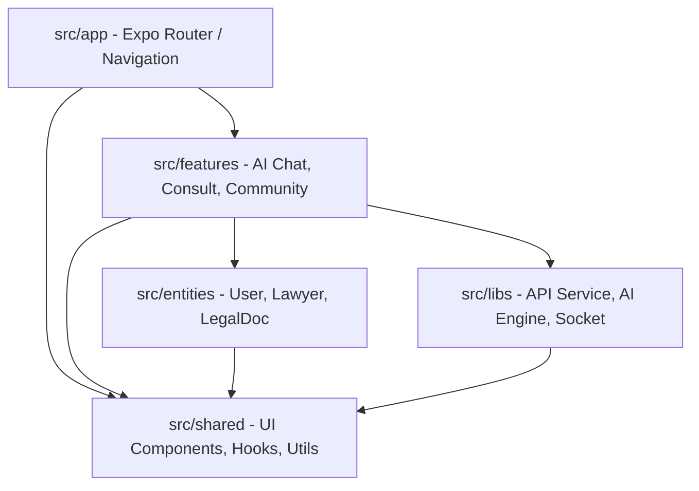

# Mature Architecture Implementation: DDD + FSD — ILC-APP

Dokumen ini menjelaskan rencana implementasi arsitektur matang yang menggabungkan **Domain-Driven Design (DDD)** dan **Feature-Slice-Driven (FSD)** untuk mendukung skalabilitas dan kemudahan pemeliharaan.

## 1. Layer Structure (FSD)
Kita membagi kode berdasarkan tanggung jawab bisnis dan teknis:

### `src/app/`
- Entry point aplikasi.
- Konfigurasi router (Expo Router).
- Global layout dan providers.

### `src/features/` (Feature Slices)
Berisi fitur bisnis yang terisolasi. Setiap folder fitur memiliki struktur internal:
- `ui/`: Komponen layar dan komponen spesifik fitur.
- `domain/`: Business logic, constants, types, entities spesifik fitur.
- `services/`: API clients dan side effects (services).
- `hooks/`: React hooks spesifik fitur.
- `index.ts`: Public API untuk fitur tersebut.

### `src/entities/` (Shared Domain Entities)
Berisi domain models yang digunakan oleh banyak fitur (e.g., `User`, `Lawyer`, `LegalCase`).

### `src/shared/` (Cross-cutting Concerns)
- `ui/`: Generic UI components (Ag-UI wrappers, common buttons).
- `libs/`: Integrasi library eksternal (API Client, Storage).
- `hooks/`: Generic hooks (useForm, useDebounce).
- `utils/`: Common utility functions.

---

## 2. Arsitektur Komponen (Interaksi)
Berikut adalah diagram interaksi antar layer dalam arsitektur ILC-APP:

## 3. Scalability & Maintainability
### Dependency Management
- **One-way dependency**: Layer atas boleh memanggil layer bawah, tapi tidak sebaliknya (`features` -> `entities` -> `shared`).
- **Isolasi Fitur**: Fitur dilarang memanggil internal folder fitur lain secara langsung. Komunikasi antar fitur harus melalui public API (`index.ts`).

### Code Sharing
- Gunakan `src/shared` untuk komponen dan utilitas yang benar-benar generic.
- Jika sebuah komponen digunakan oleh dua fitur tapi tidak generic, pertimbangkan untuk memindahkannya ke `entities` atau biarkan terduplikasi jika logic-nya berbeda tipis.

### Versioning
- Modul internal mengikuti Semantic Versioning dalam dokumentasi perubahan (`CHANGELOG.md`).

---

## 3. TypeScript Best Practices
### Konfigurasi Optimal
- `strict: true`: Wajib untuk keamanan tipe data yang ketat.
- `noImplicitAny: true`: Menghindari penggunaan `any` tanpa disengaja.

### Type Safety Rules
- Gunakan **Zod** untuk validasi skema data dari API (Runtime Type Safety).
- Gunakan **Discriminated Unions** untuk state yang kompleks (e.g., Request State: Loading | Success | Error).
- Hindari Type Casting (`as AnyType`) kecuali benar-benar diperlukan (misal: saat integrasi library pihak ketiga yang tipenya tidak lengkap).

---

## 4. Development Workflow
### Code Review Checklist
- [ ] Apakah logic sudah dipisahkan dari UI?
- [ ] Apakah penamaan variabel/fungsi sudah deskriptif?
- [ ] Apakah ada error handling untuk API calls?
- [ ] Apakah sudah ada unit test untuk logic baru?

### Testing Strategy
- **Piramida Testing**:
  - Unit Test (80%): Logic bisnis dan utils.
  - Integration Test (15%): Flow antar komponen/layanan.
  - E2E Test (5%): Critical user journey (Login, Ask).

### CI/CD Pipeline Design
- Linting & Type Checking pada setiap Commit.
- Unit Testing pada setiap Pull Request.
- Automated Build & Deploy ke Staging via EAS pada Merge ke `main`.

---
*Status: Actionable & Ready for Implementation*
