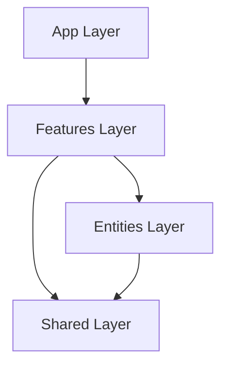

# Mature Architecture Implementation Plan — ILC-APP

Rencana integrasi FSD, DDD, dan Hybrid Modular Architecture untuk sistem yang scalable dan maintainable.

## 1. Integrasi FSD, DDD & Hybrid Modular

### Struktur Layer
1. **App Layer (`app/`)**: Hanya untuk routing, layout global, dan provider utama.
2. **Features Layer (`src/features/`)**:
   - Berisi slice fitur yang terisolasi (contoh: `ask`, `community`, `auth`).
   - Setiap slice memiliki: `ui/`, `domain/`, `services/`, `hooks/`, `index.ts`.
3. **Entities Layer (`src/entities/`)**: Domain bisnis yang dibagi bersama (contoh: `User`, `Case`, `Practitioner`).
4. **Shared Layer (`src/shared/`)**: Kode yang benar-benar generik (UI Kit, Generic Hooks, API Client).

### Diagram Interaksi Komponen


## 2. Scalability & Maintainability

### Mechanism Dependency Management
- **Strict Isolation**: Fitur tidak boleh mengimpor langsung dari fitur lain.
- **Public API**: Setiap folder fitur wajib memiliki `index.ts` yang mengekspor hanya apa yang diperlukan oleh dunia luar.
- **Cross-Feature Communication**: Gunakan Event Bus atau Shared State (Context API) jika dua fitur perlu berinteraksi.

### Strategi Code Sharing
- Gunakan folder `src/shared` untuk komponen UI yang dipakai di lebih dari satu fitur.
- Gunakan `src/entities` untuk logika bisnis (models/types) yang dipakai lintas fitur.

### Pedoman Versioning Modul
- Gunakan **Semantic Versioning (SemVer)** untuk dokumentasi perubahan internal.
- Catat perubahan besar di `CHANGELOG.md`.

## 3. TypeScript Best Practices

### Konfigurasi Optimal (`tsconfig.json`)
```json
{
  "compilerOptions": {
    "strict": true,
    "noImplicitAny": true,
    "strictNullChecks": true,
    "paths": {
      "@/*": ["./src/*"],
      "@features/*": ["./src/features/*"],
      "@shared/*": ["./src/shared/*"],
      "@entities/*": ["./src/entities/*"]
    }
  }
}
```

### Aturan Type Safety
- **No `any`**: Gunakan `unknown` jika tipe benar-benar tidak diketahui.
- **Discriminated Unions**: Gunakan untuk state (misal: `type State = Loading | Success | Error`).
- **Utility Types**: Manfaatkan `Pick`, `Omit`, `Partial` untuk fleksibilitas.

## 4. Development Workflow End-to-End

### Alur Kerja
1. **Design First**: Buat spesifikasi di `docs/05-features/` sebelum koding.
2. **Feature Branching**: Kerjakan di branch `feat/`.
3. **Automated Check**: Jalankan lint & test lokal.
4. **Code Review**: Minimal 1 reviewer.

### Code Review Checklist
- [ ] Apakah struktur mengikuti FSD?
- [ ] Apakah ada penggunaan `any`?
- [ ] Apakah unit test sudah mencakup skenario utama?
- [ ] Apakah penamaan mengikuti Ubiquitous Language?

### CI/CD Pipeline Design
- **Trigger**: Push ke `develop` atau `main`.
- **Stages**:
  1. **Install**: `npm ci`.
  2. **Lint**: `npm run lint`.
  3. **Test**: `npm run test -- --coverage`.
  4. **Build**: Expo build (EAS).
  5. **Deploy**: Submit ke Store/OTA Update.

### Metrik Kualitas Kode
- **Test Coverage**: Minimal 80%.
- **Maintainability Index**: Tinggi (diukur dengan tool statis).
- **Cyclomatic Complexity**: Rendah (< 10 per fungsi).
