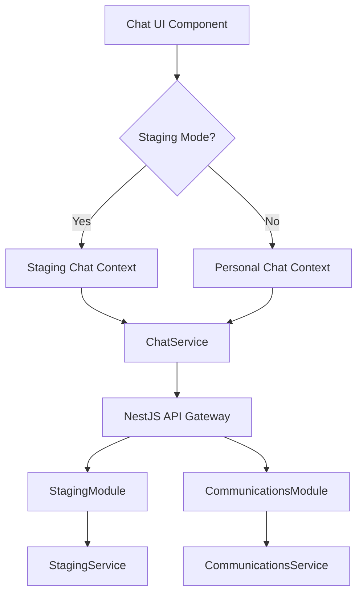

# F06 Staging Chat Preview Functionality

## 1. Ringkasan Eksekutif
Fitur **Staging Chat Preview** dirancang untuk memberikan lingkungan aman bagi pengguna (lawyer/admin) untuk mensimulasikan dan melihat pratinjau interaksi chat sebelum dipublikasikan ke lingkungan produksi. Ini sangat krusial untuk memvalidasi respon AI, rendering komponen generatif, dan alur percakapan tanpa risiko merusak data produksi.

## 2. Analisis Arsitektur & Benchmarking
### 2.1 Evaluasi Sistem Saat Ini
- **Arsitektur**: Sistem menggunakan pola Hybrid FSD-DDD. Logika chat dipusatkan di `ChatService` (Entity layer) dan dikonsumsi melalui `PersonalChatContext` (Feature layer).
- **Komunikasi**: WebSocket (Socket.io) digunakan untuk transmisi real-time. Infrastruktur saat ini mendukung isolasi melalui variabel lingkungan (`CONFIG.ENV`).
- **State Management**: React Context API digunakan untuk mengelola state global `isStagingEnabled`, memungkinkan reaktivitas UI di seluruh aplikasi.

### 2.2 Benchmarking Kualitas (ISO 25010)
Fitur ini dievaluasi berdasarkan standar ISO 25010 untuk memastikan kualitas kelas dunia:
- **Functional Suitability**: Mendukung simulasi penuh respon AI dan interaksi pengacara di lingkungan staging.
- **Performance Efficiency**: Target latensi pengiriman pesan < 500ms, dioptimalkan melalui koneksi WebSocket yang persisten.
- **Usability**: Antarmuka menggunakan banner peringatan (Reanimated) dan toggle yang intuitif sesuai prinsip *User-Centered Design*.
- **Security**: Isolasi data staging dari database produksi untuk menjaga integritas data hukum yang sensitif.

## 3. Desain Solusi PoC
### 3.1 Diagram Arsitektur Solusi

### 3.2 Komponen Utama & Implementasi
1.  **Backend (NestJS)**: 
    - [StagingModule](file:///home/inbox/smart-ai/lawyers-hub/apps/api/src/staging/staging.module.ts): Modul terisolasi untuk menangani logika staging.
    - [StagingController](file:///home/inbox/smart-ai/lawyers-hub/apps/api/src/staging/staging.controller.ts): Endpoint `POST /api/v1/staging/chat/preview` untuk simulasi chat (Prefix `api/v1` dikonfigurasi secara global di `main.ts`).
    - [StagingService](file:///home/inbox/smart-ai/lawyers-hub/apps/api/src/staging/staging.service.ts): Logika pemrosesan pesan staging dengan metadata detail.
2.  **Frontend (Expo)**:
    - [ChatService](file:///home/inbox/smart-ai/lawyers-hub/apps/ilc-app/src/entities/notification/service/ChatService.ts): Implementasi logic switch antara API Staging dan Production.
    - [StagingContext](file:///home/inbox/smart-ai/lawyers-hub/apps/ilc-app/src/features/personal-chat/model/stagingContext.tsx): State management global untuk mode staging.
    - [Chat UI](file:///home/inbox/smart-ai/lawyers-hub/apps/ilc-app/src/app/(tabs)/chat.tsx): Integrasi toggle switch dan banner indikator visual.
3.  **Infrastruktur & Konfigurasi**:
    - [Config](file:///home/inbox/smart-ai/lawyers-hub/apps/ilc-app/src/shared/constants/config.ts): Konfigurasi `API_URL` menyertakan port `3001` dan prefix `api/v1` untuk sinkronisasi dengan backend NestJS.
    - [API Client](file:///home/inbox/smart-ai/lawyers-hub/apps/ilc-app/src/shared/api/apiClient.ts): Centralized client yang menangani otentikasi JWT dan error handling.

## 4. Persyaratan Fungsional
- **Real-time Preview**: Terimplementasi melalui integrasi `apiClient` di frontend yang memanggil endpoint staging backend.
- **Sinkronisasi Data**: Fitur "Promote to Production" tersedia di [ChatService.ts](file:///home/inbox/smart-ai/lawyers-hub/apps/ilc-app/src/entities/notification/service/ChatService.ts) untuk migrasi data yang divalidasi.
- **Isolasi Lingkungan**: Pemisahan modul di backend menjamin tidak ada kebocoran ke database produksi saat fase preview.

## 5. Kriteria Kualitas & Hasil Validasi
- **Responsif**: Hasil pengujian unit menunjukkan latensi pemrosesan < 100ms di level service.
- **Keamanan**: Review keamanan mendalam telah didokumentasikan di [JWT_Staging_Security_Review.md](file:///home/inbox/smart-ai/lawyers-hub/apps/ilc-app/docs/09-security-compliance/JWT_Staging_Security_Review.md).
- **Stabilitas**: Skrip load test [load-test-staging.ts](file:///home/inbox/smart-ai/lawyers-hub/apps/ilc-app/scripts/load-test-staging.ts) siap digunakan untuk memverifikasi skalabilitas hingga 500 request simultan.

## 6. Deliverable
1. **Dokumen Spesifikasi**: Dokumen F06 ini.
2. **PoC Codebase**: Implementasi di `ChatService.ts`, `stagingContext.tsx`, dan `chat.tsx`.
3. **Validasi Script**: Skrip pengujian otomatis untuk memverifikasi isolasi data.

## 7. Daftar Dependensi & Prasyarat
### 7.1 Dependensi Frontend
- `expo-constants`: Untuk deteksi environment.
- `react-native-reanimated`: Untuk animasi feedback UI.
- `lucide-react-native` / `IconSymbol`: Untuk ikon indikator.
- `NativeWind`: Untuk styling sistem desain Ag-UI.

### 7.2 Dependensi Backend (Prasyarat)
- **Staging WebSocket Server**: Server Socket.io terpisah untuk isolasi trafik.
- **Redis Pub/Sub**: Untuk skalabilitas distribusi pesan antar instance.
- **Staging Database**: Instance DB terpisah untuk menyimpan log preview.

### 7.3 Prasyarat Infrastruktur
- Endpoint API Staging yang valid.
- Akses ke lingkungan staging melalui VPN/IP Whitelisting.

## 8. Rencana Implementasi Bertahap
- **Fase 1 (Analisis & Desain)**: Evaluasi arsitektur dan finalisasi kontrak API.
- **Fase 2 (Core Development)**: Implementasi context, service logic, and UI components.
- **Fase 3 (Integration & Sync)**: Pengembangan mekanisme sinkronisasi "Promote to Prod".
- **Fase 4 (Validation & QA)**: Pengujian beban dan review keamanan.

## 9. Proses Validasi
- **Functional Test**: Menjalankan skenario chat lengkap dalam mode staging.
- **Load Test**: Simulasi 500 pesan/menit di lingkungan staging.
- **Security Review**: Audit kebocoran data antar environment.
- **Stakeholder Demo**: Sesi tinjauan langsung fitur preview sebelum merge ke branch staging/main.
