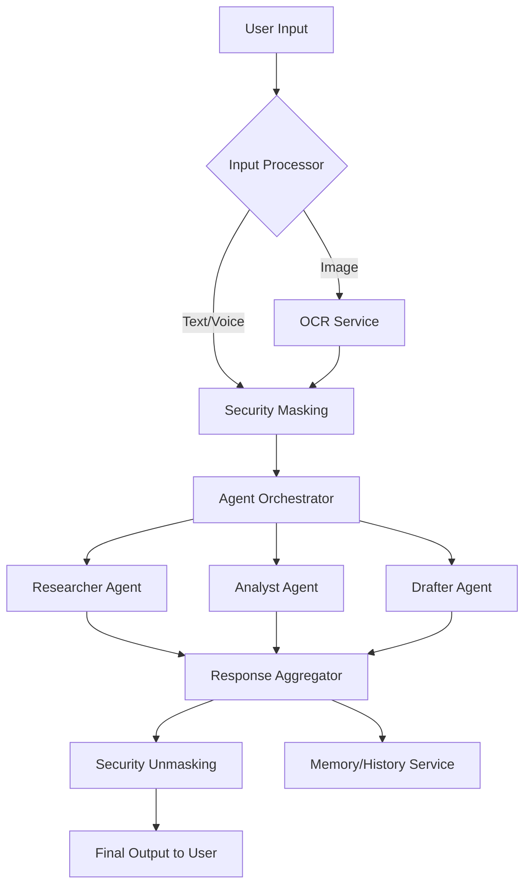

# Analisis Strategis Fitur Chat "Ask AI" ILC-APP

## 1. Pendahuluan
Dokumen ini menyajikan analisis mendalam mengenai fitur "Ask AI" dalam ekosistem ILC-APP, yang dirancang untuk menjadi asisten hukum cerdas bagi para profesional dan masyarakat di Indonesia. Analisis ini mencakup kebutuhan pengguna, arsitektur sistem, fitur prioritas, dan praktik terbaik berdasarkan tren industri global.

## 2. Identifikasi Kebutuhan Pengguna & Kasus Penggunaan
### 2.1 Kebutuhan Pengguna Utama
- **Kecepatan & Akurasi**: Pengguna membutuhkan jawaban hukum yang cepat namun tetap berbasis pada peraturan yang berlaku (no hallucinations).
- **Privasi Data**: Perlindungan terhadap informasi sensitif (PII) sesuai dengan UU PDP.
- **Kemudahan Akses**: Antarmuka yang intuitif untuk pencarian, pemindaian dokumen, dan konsultasi.

### 2.2 Kasus Penggunaan Utama
- **Penelitian Hukum Kilat**: Mencari pasal, undang-undang, atau putusan MA terkait kasus spesifik.
- **Analisis Risiko Kontrak**: Memindai draf perjanjian untuk mengidentifikasi klausul berbahaya atau yang hilang.
- **Penyusunan Dokumen**: Menghasilkan draf somasi, gugatan, atau perjanjian sederhana.
- **Edukasi Hukum**: Memberikan penjelasan hukum yang mudah dipahami bagi masyarakat awam.

## 3. Evaluasi Arsitektur Sistem
### 3.1 Mekanisme Pemrosesan Input
- **Multimodal Input**: Mendukung teks, suara, dan gambar (OCR).
- **Security Layer**: Implementasi `SecurityUtils.maskPII` untuk menyamarkan data sensitif sebelum dikirim ke model AI.
- **Preprocessing**: Pembersihan teks dan identifikasi niat (intent detection).

### 3.2 Integrasi Model AI (Agentic Orchestration)
- **Multi-Agent System**: Menggunakan `AgentOrchestrator` untuk membagi tugas ke agen spesialis:
  - `ResearcherAgent`: Mencari referensi hukum.
  - `AnalystAgent`: Mengevaluasi fakta.
  - `DrafterAgent`: Menyusun respons/dokumen.
- **Model Agnostic**: Mendukung integrasi dengan Google Gemini 1.5 Pro dan Anthropic Claude 3.5 Sonnet sebagai fallback atau pemroses utama.

### 3.3 Manajemen Konteks
- **Chat History**: Penyimpanan percakapan menggunakan `chatHistoryRepository` dengan persistensi lokal.
- **Context Windows**: Pengiriman riwayat percakapan yang relevan ke AI untuk menjaga kontinuitas diskusi.
- **Memory Service**: Menyimpan preferensi pengguna dan "pengalaman" AI untuk personalisasi di masa depan.

## 4. Analisis Fitur Penting
### 4.1 Pemahaman Konteks & Multi-Bahasa
- **Deep Context**: Kemampuan merujuk kembali ke pesan-pesan sebelumnya dalam satu sesi.
- **Localization**: Dukungan penuh Bahasa Indonesia dengan istilah hukum resmi (Ubiquitous Language) dan Bahasa Inggris untuk konteks internasional/bisnis.

### 4.2 Mekanisme Fallback & Kepercayaan
- **Confidence Scoring**: Memberikan indikator tingkat keyakinan AI terhadap jawaban.
- **Trust Signals**: Menampilkan sumber resmi (JDIH, MA) dan status verifikasi.
- **Model Fallback**: Jika satu provider (misal: Gemini) gagal atau memberikan skor rendah, sistem secara otomatis mencoba provider lain (misal: Claude).

## 5. Rekomendasi Implementasi & Fitur Prioritas
### 5.1 Diagram Arsitektur (High-Level)

### 5.2 Daftar Fitur Prioritas (Roadmap)
1. **P1 (Mendesak)**: Optimasi latensi, perbaikan i18n keys, dan verifikasi alur API.
2. **P2 (Pengembangan)**: Implementasi "Optional Tunes" (Tone & Style selection) dan mode Interaksi Fleksibel (Simple/Advanced).
3. **P3 (Lanjutan)**: Sistem ekspor hasil (PDF/Markdown) dan integrasi dengan kalender/task management hukum.

## 6. Kesimpulan & Praktik Terbaik
ILC-APP harus mengadopsi pendekatan **"Privacy-First, Context-Always"**. Penggunaan RAG (Retrieval-Augmented Generation) yang terhubung dengan database hukum resmi Indonesia adalah kunci untuk menghindari halusinasi dan membangun kepercayaan pengguna. Kontinuitas antara fitur "Ask" dan "Community" akan menciptakan ekosistem hukum yang unik dan bernilai tinggi.
