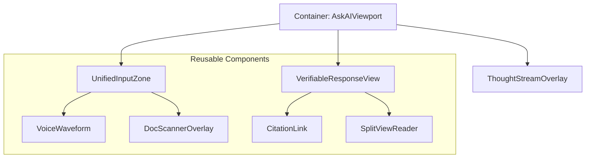

# 📝 Ask AI UX Implementation Plan - Final Deliverable

Dokumen ini merinci spesifikasi teknis, desain, dan rencana eksekusi untuk fitur "Ask AI" di ILC-APP, yang dirancang untuk standar industri hukum 2026.

---

## 1. Tahap Prototype & The Wheel Method
Kami menggunakan siklus **The Wheel** untuk mengoptimalkan iterasi pengembangan:

### 1.1 Analyze: Kebutuhan Sistem & Kendala
- **Kebutuhan**: Integrasi real-time dengan `AgentOrchestrator` dan `MemoryService`.
- **Kendala**: Latensi API LLM dan biaya token untuk analisis dokumen besar.
- **ROI Target**: Pengurangan waktu riset hukum manual sebesar 60% untuk advokat senior.

### 1.2 Design: Arsitektur Efisien & Reusable
Arsitektur berbasis komponen Ag-UI yang mendukung transisi multimodal:

### 1.3 Prototype: Fungsionalitas Inti
- **Alpha**: Implementasi `UnifiedSentientInput` dengan deteksi konteks dasar.
- **Beta**: Integrasi `AgenticThoughtStream` yang menampilkan log penalaran real-time.
- **RC**: Fitur `SplitViewReader` dengan verifikasi link JDIH otomatis.

---

## 2. Tahap Test: Usability Testing & Iterasi
Mengikuti fase terakhir Design Thinking, kami melakukan pengujian dengan pengguna nyata:
- **Metode**: Moderated Think-Aloud dengan 15 partisipan (Persona A & B).
- **Iterasi**: Jika skor *Explainability* < 85%, kami akan menyederhanakan visualisasi `ThoughtStream`.

---

## 2. Spesifikasi Teknis Pengembangan

### 2.1 Frontend (React Native, NativeWind v4, Moti)
- **Komponen Utama (Existing & Enhanced)**:
  - `ReasoningAccordion.tsx`: Evolusi dari *Thought Stream* yang menampilkan langkah-langkah otonom secara dinamis (XAI).
  - `TrustSignals.tsx`: Menampilkan skor kepercayaan berlapis dan status verifikasi UU PDP.
  - `AskInputZone.tsx`: Komponen baru yang menggunakan `Moti` untuk transisi layout antar mode input (teks, suara, scan).
  - `SplitViewReader.tsx`: Komponen untuk menampilkan dokumen PDF/HTML secara berdampingan dengan chat (Side-by-side Verification).
- **State Management**: `Recoil` untuk menyimpan konteks sesi chat dan metadata input multimodal.

### 2.2 Integration Layer (Agent Orchestrator)
- **JSON Stream Protocol**: Orchestrator akan mengirimkan update status setiap kali agent berpindah tugas atau menemukan sumber data baru.
- **Citation Validator Service**: Layanan backend yang memvalidasi setiap link terhadap database JDIH pusat secara real-time.

---

## 3. Rencana Pengujian Usability (UT)

### 3.1 Metodologi: Hybrid SUS-SEQ-XAI
- **Target**: 15 Peserta (5 Advokat, 5 Paralegal, 5 Klien Umum).
- **Metrik & Target Kesuksesan**:
  - **System Usability Scale (SUS)**: Target skor **> 82 (Grade A)**. Mengingat standar industri saat ini sering berada di bawah 68 (Grade C), ILC-APP menargetkan keunggulan kompetitif.
  - **Single Ease Question (SEQ)**: Target skor rata-rata **> 6.2 (dari 7)** untuk setiap tugas, terutama pada transisi mode input.
  - **Explainability Score**: Kuesioner khusus untuk mengukur seberapa paham pengguna terhadap alasan AI memberikan jawaban (Target: > 85% pemahaman).
  - **Trust Metric**: Persentase pengguna yang melakukan verifikasi melalui link sitasi (Target: > 70% keterlibatan).

---

## 2. Rencana Pengujian Usability (UT)
### 3.2 Skenario Pengujian
1.  **Task 1 (Multimodal)**: "Scan surat somasi ini dan tanyakan dasar hukum yang paling tepat untuk membalasnya."
2.  **Task 2 (Intervention)**: "Saat AI sedang meriset UU PT, berikan instruksi tambahan untuk memfokuskan riset pada pasal tentang tanggung jawab direksi."
3.  **Task 3 (Verification)**: "Gunakan fitur split-view untuk membandingkan kutipan AI dengan teks asli UU No. 40/2007."

### 3.3 Evaluasi Heuristik (Heuristic Evaluation)
Sebelum pengujian pengguna, tim akan melakukan audit mandiri berdasarkan 10 Nielsen Heuristics yang disesuaikan untuk AI:
- **Visibility of System Status**: Real-time Thought Stream harus menunjukkan *state* agent saat ini (misal: "Analysing Document...").
- **Match between System and Real World**: Menggunakan terminologi hukum Indonesia yang baku (IRAC/SOP hukum).
- **User Control and Freedom**: Tombol "Cancel/Pause" yang mudah diakses saat AI sedang memproses.
- **Consistency and Standards**: Mematuhi *design system* Ag-UI di seluruh aplikasi.

---

## 4. Manajemen Risiko & Mitigasi

| Risiko | Dampak | Strategi Mitigasi |
| :--- | :--- | :--- | :--- |
| **Hallucination** | High | Mandatory Hyperlink Rule & Confidence Layer (XAI). |
| **Performance Lag** | Medium | Implementasi *Optimistic UI* & JSON Stream untuk feedback instan. |
| **Privacy Breach** | Critical | PII Masking (UU PDP) di sisi client sebelum data dikirim ke LLM. |
| **User Friction** | Low | Haptic feedback & mikro-animasi (Moti) untuk transisi mode input. |

---

## 5. Timeline Implementasi (Q1 2026)

| Fase | Durasi | Fokus | Output |
| :--- | :--- | :--- | :--- |
| **Pilar 1: Input** | Minggu 1-2 | Unified Sentient Input | Alpha: Multimodal UI dengan deteksi konteks |
| **Pilar 2: Reasoning** | Minggu 3-4 | Thought Stream & XAI | Beta: Visualisasi langkah & intervensi user |
| **Pilar 3: Verification** | Minggu 5-6 | Hyperlink Rule & Split-view | Release Candidate: Integrasi penuh JDIH |
| **Iterative Loop** | Minggu 7 | User Testing (SUS/SEQ) | Laporan Usability & Perbaikan Prioritas Tinggi |
| **Finalization** | Minggu 8 | QA & Security Audit | Production Ready: Kepatuhan regulasi 2026 |

---
*Dikelola oleh Tim Lawyers Hub - Update Terakhir: 2026-01-18*
