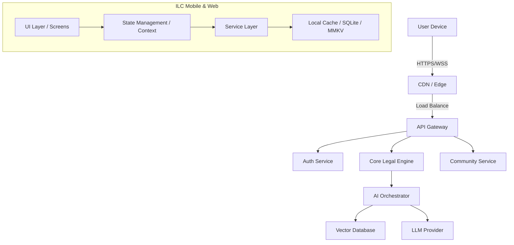

# 🏗️ Playbook Arsitektur Layanan ILC-APP

## 1. Ikhtisar Arsitektur
ILC-APP mengadopsi arsitektur **Modular Monolith** dengan pendekatan **Service-Oriented** di sisi klien (Mobile/Web). Aplikasi ini dirancang untuk skalabilitas tinggi, keamanan data, dan pengalaman pengguna yang responsif.

### 1.1 Diagram Tingkat Tinggi

## 2. Lapisan Aplikasi (Client-Side)

### 2.1 UI Layer (Presentation)
- **Framework**: React Native / Expo (Managed Workflow).
- **Styling**: NativeWind (Tailwind CSS) untuk konsistensi desain.
- **Navigasi**: Expo Router (File-based routing) v7.
- **Komponen**: Atomic Design (Atoms, Molecules, Organisms) di folder `components/`.

### 2.2 State Management Layer
- **Global State**: Recoil / React Context untuk data yang jarang berubah (User Profile, Theme).
- **Server State**: React Query (TanStack Query) direkomendasikan untuk caching data API.
- **Local State**: `useState` dan `useReducer` untuk logika komponen lokal.

### 2.3 Service Layer (Business Logic)
Terletak di folder `services/`, lapisan ini menangani komunikasi dengan API dan logika bisnis kompleks.
- `ai.ts`: Mengelola interaksi dengan AI Agent, termasuk validasi *Trust Signals*.
- `auth.ts`: Menangani otentikasi, penyimpanan token aman, dan rotasi token.
- `community.ts`: Mengelola feed, komentar, dan interaksi sosial.
- `api.ts`: Konfigurasi Axios sentral dengan interceptors untuk Error Handling dan Auth Injection.

### 2.4 Data Persistence Layer
- **Secure Store**: Penyimpanan token sensitif (JWT).
- **AsyncStorage / MMKV**: Penyimpanan preferensi pengguna dan cache non-sensitif.
- **SQLite**: (Opsional) Untuk penyimpanan data offline yang kompleks.

## 3. Komponen Backend (Ringkasan)

### 3.1 API Gateway
Bertindak sebagai pintu masuk tunggal, menangani Rate Limiting, CORS, dan Routing dasar.

### 3.2 Core Services
- **User Service**: Profil, Preferensi, Role Management.
- **Legal Engine**: Indeksasi dokumen hukum, pencarian semantik.
- **Billing Service**: Langganan, Pembayaran, Invoicing.

### 3.3 Infrastructure
- **Database**: PostgreSQL (Relational Data), Pinecone/Milvus (Vector Data).
- **Storage**: S3-compatible storage untuk dokumen dan media.
- **Compute**: Containerized services (Docker/Kubernetes).

## 4. Pola Desain & Best Practices

### 4.1 Dependency Injection
Gunakan pola DI ringan pada Service Layer untuk memudahkan Unit Testing. Service diekspor sebagai instance singleton atau factory function.

### 4.2 Error Handling Strategy
- **Client-Side**: Gunakan `ErrorBoundary` untuk menangkap crash UI.
- **Service-Side**: Normalisasi error API menjadi objek `AppError` yang standar.
- **Logging**: Kirim log error kritis ke layanan monitoring (Sentry).

### 4.3 Security Standards
- **SSL Pinning**: Mencegah Man-in-the-Middle attacks.
- **Biometric Auth**: Opsi login cepat yang aman.
- **Input Sanitization**: Validasi semua input pengguna sebelum dikirim ke API.

## 5. Alur Data (Data Flow)

1. **User Action**: Pengguna menekan tombol "Cari Kasus".
2. **Event Handling**: Komponen UI memanggil `LegalSearchService`.
3. **State Update**: UI menampilkan loading state (Skeleton).
4. **Service Execution**:
   - Cek Cache Lokal. Jika ada dan valid, kembalikan data.
   - Jika tidak, request ke API via `apiClient`.
5. **Response Processing**:
   - Validasi respons API (Schema check).
   - Normalisasi data.
   - Simpan ke Cache.
6. **UI Render**: Update state dengan hasil pencarian.

---
*Dokumen ini diperbarui secara berkala seiring evolusi arsitektur sistem.*
