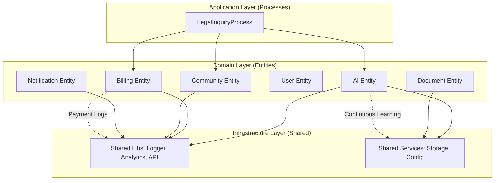
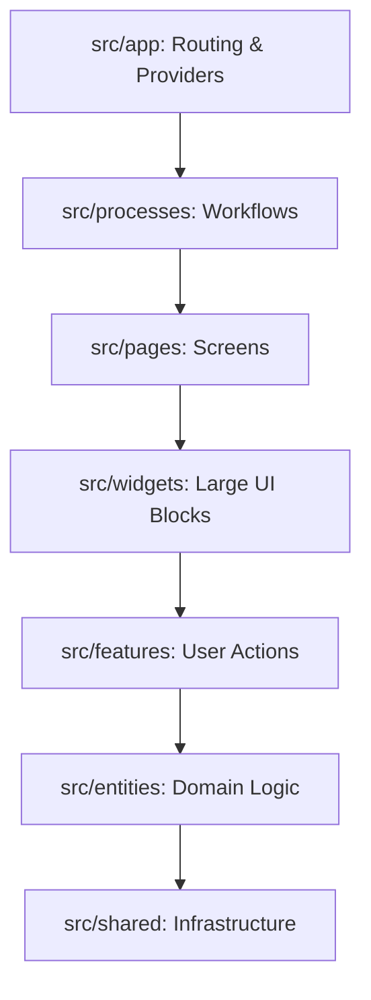

# ILC-APP (Indonesia Lawyers Club)

Selamat datang di repositori **ILC-APP**, aplikasi mobile/web berbasis AI yang dirancang untuk merevolusi akses hukum di Indonesia.

## 📚 Dokumentasi Terpadu
Dokumentasi proyek ini adalah bagian dari ekosistem **Lawyers Hub**. Silakan merujuk pada:

- [**🌐 Strategi Ecosystem-First**](00-overview/Ecosystem_First_Strategy.md): Visi integrasi ILC & Lawyers Hub.
- [**🏗️ Arsitektur Global**](../../docs/01_architecture/README.md): Desain backend bersama dan multi-tenancy.
- [**🛡️ Kepatuhan UU PDP**](../../docs/07_compliance_and_audit/README.md): Standar keamanan data ekosistem.

### 📖 Panduan Spesifik ILC
- [**00-overview**](docs/00-overview/README.md): Visi, Misi, dan Cakupan Proyek ILC.
- [**01-product**](docs/01-product/README.md): Product Requirements Document (PRD).
- [**02-technical-architecture**](docs/02-technical-architecture/README.md): Diagram sistem mobile dan struktur data.
- [**03-mobile-implementation**](docs/03-mobile-implementation/README.md): Standar pengembangan UI/UX dengan Expo.
- [**05-features**](docs/05-features/README.md): Dokumentasi detail fitur-fitur utama.
  - [01-AI Legal Engine](docs/05-features/F01_AI_Search_Answer.md)
  - [02-Consultation Workflow](docs/05-features/F02_Consultation_Workflow.md)
  - [03-RealTime Chat](docs/05-features/F03_RealTime_Chat.md)
  - [04-Document Automation](docs/05-features/F04_Document_Automation.md)
  - [05-Notification System](docs/05-features/F05_Notifications.md)
  - [06-Generative UI & Collaboration](docs/05-features/06-generative-ui-collaboration.md)
  - [07-Community Hub](docs/05-features/F07_Community_Hub.md)
- [**11-playbooks**](docs/11-playbooks/): Panduan operasional ("How-to") dan pemecahan masalah.
  - [**Arsitektur Layanan**](docs/11-playbooks/01-service-architecture.md): Detail implementasi backend-for-frontend.
  - [**Fixing Navigation**](docs/11-playbooks/navigation_fix.md): Troubleshooting React Navigation.

## 🏗️ Arsitektur Proyek: Hybrid FSD-DDD Versi "Next-Generation"

Proyek ini menggunakan arsitektur **Hybrid FSD-DDD (Feature-Sliced Design + Domain-Driven Design)** yang dioptimalkan untuk aplikasi mobile AI-native.

### Struktur Arsitektur & Alur Data

### Layer Utama (FSD Layers)

- **`src/app`**: Routing (Expo Router) dan entry point aplikasi.
- **`src/processes`**: Alur bisnis kompleks lintas fitur (misal: AI Drafting Flow).
- **`src/pages`**: Komposisi layar utuh (Screen Components).
- **`src/widgets`**: Komponen UI besar & mandiri (misal: LegalFeed, ChatWindow).
- **`src/features`**: Aksi pengguna yang spesifik (misal: `auth`, `ai-chat`, `legal-search`).
- **`src/entities`**: Logika bisnis inti berbasis **Bounded Context** (misal: `ai`, `user`, `billing`, `lawyer`, `case`).
- **`src/shared`**: Komponen UI atomik (Ag-UI), API client (Axios/Socket), hooks, dan utilitas generik (Logger, Error).

### Agentic Lifecycle (Next-Gen AI)
Sistem mengadopsi siklus hidup otonom untuk penyelesaian masalah hukum:
1. **Planning**: Memecah pertanyaan kompleks menjadi langkah-langkah kecil.
2. **Context Gathering**: Mengumpulkan rujukan hukum dan memori masa lalu.
3. **Analysis**: Sintesis data oleh AI Specialist (Analyst Agent).
4. **Action**: Memberikan jawaban dan menyiapkan langkah aksi (Generative UI).
5. **Self-Evaluation**: Validasi akurasi jawaban sebelum ditampilkan.

### Prinsip Pengembangan
1. **Domain Centric**: Logika bisnis murni harus berada di dalam `src/entities`.
2. **Inward Dependency**: Layer yang lebih luar (App/Pages/Features) bergantung pada layer yang lebih dalam (Entities/Shared), bukan sebaliknya.
3. **Ubiquitous Language**: Menggunakan terminologi hukum yang konsisten (misal: `LegalInquiry`, `TrustSignals`).
4. **Agentic Workflow**: Mendukung orkestrasi agen AI secara otonom di layer domain.
5. **Standardized UI Elements**: Semua elemen interaktif (Button, Pressable) menggunakan komponen bersama `src/shared/components/ui/button.tsx` untuk konsistensi haptics, animasi, dan aksesibilitas.
6. **SOLID Service Contracts**: Layanan inti (Auth, Analytics, Notification, Billing, AI) diimplementasikan menggunakan antarmuka (interfaces) untuk memfasilitasi pengujian, fleksibilitas, dan skalabilitas.
7. **Integrated Trust Signals**: Integrasi *social proof* real-time (Recent Activity, Platform Trust Bar, Testimonials) dan indikator keamanan di seluruh alur kerja untuk membangun kepercayaan pengguna.
8. **Advanced Document Scanning**: Pemindaian dokumen hukum berbasis AI dengan enkripsi selama proses dan analisis mendalam menggunakan orkestrasi multi-agen.

Untuk detail lebih lanjut mengenai implementasi, silakan baca [Rancangan Implementasi FSD-DDD-Hybrid](../.trae/rancangan%20implementasi%20FSD-DDD-Hybrid%20versi%20“next-generation”.md).

---

## 🏗️ Fitur Utama

### 1. AI Legal Engine
Menggunakan **Agentic Workflow** untuk memberikan jawaban hukum yang akurat dengan *Trust Signals* (sumber terverifikasi).

### 2. Community Hub
Platform sosial untuk diskusi kasus, berbagi wawasan, dan *networking* antar profesional hukum.

### 3. Smart Document Drafting
Editor kolaboratif (Yjs) untuk menyusun dokumen hukum secara real-time.

## 🛡️ Keamanan & Kualitas

### Standar Pengembangan
- **Type Safety**: TypeScript Strict Mode.
- **Linting**: ESLint + Prettier.
- **Testing**: Jest (Unit) + Maestro (E2E).
- **Error Handling**: Interceptor terpusat dengan normalisasi error.

### Keamanan
- **Auth**: JWT dengan rotasi token otomatis.
- **Data**: Enkripsi end-to-end untuk konsultasi privat.
- **Compliance**: Mengikuti standar perlindungan data pribadi (UU PDP).

---
*Dikelola oleh Tim Lawyers Hub - Terakhir Diperbarui: 2026-01-18*
