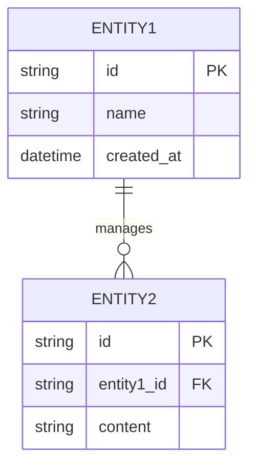
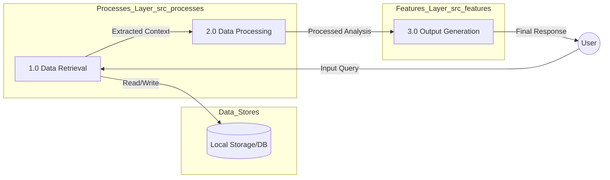
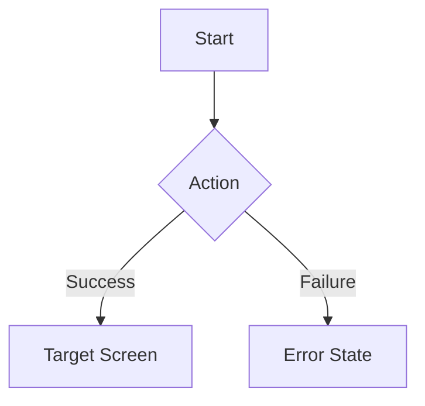
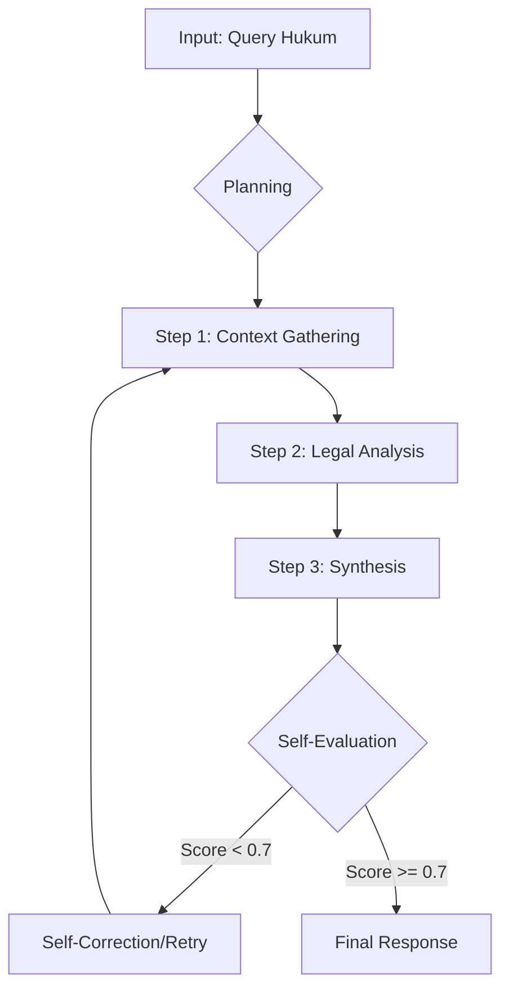
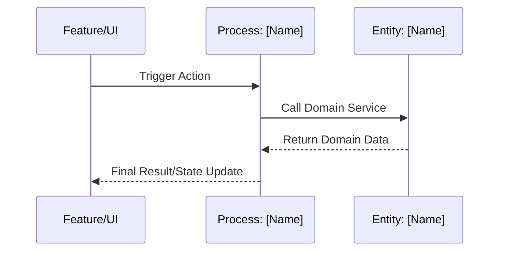
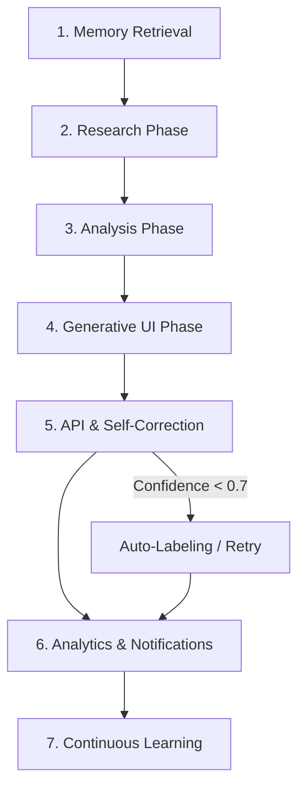

# 📄 ILC-APP Documentation Templates

Dokumen ini menyediakan koleksi template Markdown standar untuk seluruh ekosistem ILC-APP. Gunakan template ini untuk menjaga konsistensi antara desain (ADT), arsitektur (FSD-DDD), dan implementasi teknis.

## 📌 Daftar Isi
1. [🚀 Cara Menggunakan](#-cara-menggunakan)
2. [🛠️ Fase 01: Discovery (Empathize)](#-fase-01-discovery-empathize)
3. [🔍 Fase 02: Analysis (Define & Ideate)](#-fase-02-analysis-define--ideate)
4. [🎨 Fase 03: Design (Prototype)](#-fase-03-design-prototype)
5. [💻 Fase 04: Implementation (FSD-DDD Layers)](#-fase-04-implementation-fsd-ddd-layers)
6. [✅ Fase 05: QA & Validation (Test)](#-fase-05-qa--validation-test)
7. [📜 Operasional & Keamanan](#-operasional--keamanan)
8. [🤝 Panduan Kontribusi](#-panduan-kontribusi)

## 🚀 Cara Menggunakan
1. **Pilih Template**: Cari template yang sesuai dengan fase atau layer yang sedang dikerjakan.
2. **Salin & Tempel**: Salin konten blok kode ke file `.md` tujuan.
3. **Isi Detail**: Ganti placeholder seperti `[Feature Name]`, `[Entity Name]`, dll.
4. **Perbarui Metadata**: Pastikan status, tanggal, dan owner diperbarui secara berkala.

---

## 🛠️ Fase 01: Discovery (Empathize)
### Overview
Fokus pada pemahaman kebutuhan stakeholders dan batasan sistem (ADT: System Survey & Context Diagram).

### Komponen
#### 📁 `apps/ilc-app/docs/00-overview/system-survey.md`
```md
# System Survey — [Feature/Project Name]

## Metadata
- **Status**: Draft
- **Last Updated**: YYYY-MM-DD
- **Owner**: [Name/Team]
- **Reviewer**: [Product/Lead]

## Stakeholders Analysis
| Actor | Role | Pain Points | Expectations |
| :--- | :--- | :--- | :--- |
| [e.g. Advokat] | [e.g. Validator] | [e.g. Manual process] | [e.g. Automation] |

## Top-Down Decomposition
| Module/Entity | Responsibility | Layer (FSD) |
| :--- | :--- | :--- |
| `[Entity Name]` | [Description] | `src/entities` |

## System Boundaries (ADT)
Deskripsi batasan fitur ini dalam ekosistem ILC-APP.

## Interview Highlights
Ringkasan poin penting dari wawancara atau survei lapangan.
```

#### 📁 `apps/ilc-app/docs/00-overview/stakeholder-interview-guide.md`
```md
# Stakeholder Interview Guide — [Stakeholder Name]

## Metadata
- **Status**: Draft
- **Last Updated**: YYYY-MM-DD
- **Owner**: Product Manager
- **Reviewer**: [Project Lead]

## Interview Goals
- [ ] Understand user pain points.
- [ ] Validate feature feasibility.

## Questions
1. Bagaimana proses Anda saat ini dalam menangani [masalah]?
2. Apa tantangan terbesar yang Anda hadapi?

## Key Insights
- Insight 1: [Description]
- Insight 2: [Description]
```

#### 📁 `apps/ilc-app/docs/00-overview/stakeholder-sync-minutes.md`
```md
# Meeting Minutes: Stakeholder Sync — [Date]

## Metadata
- **Status**: Final
- **Last Updated**: YYYY-MM-DD
- **Owner**: Project Manager
- **Reviewer**: [Stakeholders Involved]

## Attendees
- [Name] (Role)
- [Name] (Role)

## Agenda
1. Review progress [Feature X].
2. Discuss blockers in [Module Y].

## Decisions
- **Decision 1**: [Description]
- **Decision 2**: [Description]

## Action Items
- [ ] @Name: Fix [Issue] by [Date]
```

#### 📁 `apps/ilc-app/docs/01-product/user-journey-map.md`
```md
# User Journey Map — [Persona Name]

## Metadata
- **Status**: Draft
- **Last Updated**: YYYY-MM-DD
- **Owner**: UX Researcher
- **Reviewer**: [Product Manager]

## Persona Profile
- **Role**: [e.g., Junior Lawyer]
- **Goals**: [e.g., Finding precedent cases quickly]
- **Pain Points**: [e.g., Manual search in old PDFs]

## Journey Stages
| Stage | Actions | Thoughts | Emotions | Opportunities |
| :--- | :--- | :--- | :--- | :--- |
| **Discovery** | Searches for law | "Is this the latest?" | 😟 | AI Search |
| **Analysis** | Reads pasal | "How does this apply?" | 🤔 | AI Reasoning |
| **Action** | Drafts document | "Need correct format" | 😰 | Legal Tools |

## Key Moments of Truth
Poin kritis di mana sistem ILC-APP memberikan nilai maksimal.
```

#### 📁 `apps/ilc-app/docs/02-technical-architecture/adt/context-diagram.md`
```md
# Context Diagram — [Feature Name]

## Metadata
- **Status**: Final
- **Last Updated**: YYYY-MM-DD
- **Owner**: Design Team
- **Reviewer**: [Lead Architect]

## Boundary Definition (ADT)
Definisi batasan sistem ILC-APP dengan entitas luar sesuai Prinsip ADT (System Survey).

## Diagram (Mermaid)
```mermaid
graph TD
    User((User/Client))
    [ExternalEntity](([Name]))
    System[ILC-APP: [Feature Name]]
    
    User -- Action/Input --> System
    System -- Result/Output --> User
    System -- Request --> [ExternalEntity]
    [ExternalEntity] -- Data Response --> System
```

## External Entities Mapping
| Entity Name | Role | Data In (ke Sistem) | Data Out (dari Sistem) |
| :--- | :--- | :--- | :--- |
| [Entity] | [Role] | [Description] | [Description] |
```

### Panduan Penggunaan
1. Identifikasi semua aktor luar (User, API Pemerintah, dll).
2. Tentukan batasan sistem secara jelas (apa yang masuk dalam scope dan apa yang tidak).
3. Gunakan Mermaid untuk visualisasi yang mudah diperbarui.

---

## 🔍 Fase 02: Analysis (Define & Ideate)
### Overview
Fokus pada permodelan data (ADT: ERD), dekomposisi fungsional (ADT: DFD), dan desain logis (API/Events).

### Komponen
#### 📁 `apps/ilc-app/docs/02-technical-architecture/adt/erd.md`
```md
# ERD — Logical Data Model: [Module Name]

## Metadata
- **Status**: Active
- **Last Updated**: YYYY-MM-DD
- **Owner**: Data Architect
- **Reviewer**: [Backend Lead]

## Domain Entities Relationship (DDD Mapping)
Cetak biru desain data yang dipetakan ke dalam layer `src/entities` sebagai *Bounded Context*.

## Diagram (Mermaid)


## Data Dictionary (ADT)
| Entity | Field | Type | Constraints | Description | Entity Layer Path |
| :--- | :--- | :--- | :--- | :--- | :--- |
| [Entity] | [Field] | [Type] | [PK/FK/NN] | [Description] | `src/entities/[name]` |
```

#### 📁 `apps/ilc-app/docs/02-technical-architecture/adt/dfd.md`
```md
# DFD Level 0 & 1 — Functional Decomposition: [Feature Name]

## Metadata
- **Status**: Active
- **Last Updated**: YYYY-MM-DD
- **Owner**: System Analyst
- **Reviewer**: [Lead Engineer]

## Process Mapping (ADT to FSD)
Memetakan transformasi data ke dalam arsitektur ILC-APP:
- **Level 0 (Context)**: Interaksi sistem utama dengan aktor luar.
- **Level 1 (Modular)**: Dekomposisi proses ke layer `src/processes` (Workflow) dan `src/features` (Use Cases).

## Diagram Level 0 (System Architecture)
```mermaid
graph LR
    U((User/Actor)) --> S[System: [Feature Name]]
    S --> U
    S --> E((External Entity))
```

## Diagram Level 1 (Process Decomposition)

```

#### 📁 `apps/ilc-app/docs/04-api-integration/api-contract.md`
```md
# API Contract — [Endpoint Name]

## Metadata
- **Status**: Active
- **Last Updated**: YYYY-MM-DD
- **Owner**: Backend-Frontend Bridge
- **Reviewer**: [Lead Engineer]

## Endpoint Overview
- **Path**: `POST /v1/[path]`
- **Method**: `POST`
- **Auth Required**: Yes (JWT)

## Request Schema (JSON)
```json
{
  "query": "string",
  "context": "object"
}
```

## Response Schema (JSON)
```json
{
  "id": "uuid",
  "answer": "string",
  "trustSignals": {
    "confidenceScore": "number",
    "sources": ["string"]
  }
}
```

## Error Codes
| Code | Description | Action |
| :--- | :--- | :--- |
| 401 | Unauthorized | Refresh Token |
| 422 | Validation Error | Check request body |
```

#### 📁 `apps/ilc-app/docs/02-technical-architecture/domain-event-specs.md`
```md
# Domain Event Specification — [Event Name]

## Metadata
- **Status**: Active
- **Last Updated**: YYYY-MM-DD
- **Owner**: Domain Architect
- **Reviewer**: [Tech Lead]

## Event Identification
- **Source Entity**: `src/entities/[entity-name]`
- **Event Name**: `[Domain]_[Action]_[Status]` (e.g., `USER_REGISTRATION_COMPLETED`)

## Payload Structure
| Field | Type | Description |
| :--- | :--- | :--- |
| `userId` | `string` | ID of the registered user |
| `timestamp` | `iso-date` | Event occurrence time |

## Subscribers (Handlers)
1. **NotificationService**: Trigger welcome email.
2. **AnalyticsService**: Track conversion.
```

### Panduan Penggunaan
1. Gunakan ERD untuk mendefinisikan skema data sebelum mulai coding di `src/entities`.
2. DFD Level 1 harus mencerminkan alur kerja di `src/processes`.
3. Pastikan kontrak API disetujui oleh tim Frontend dan Backend.

---

## 🎨 Fase 03: Design (Prototype)
### Overview
Fokus pada UI/UX, AI Agentic specs, dan spesifikasi modul teknis (Mod-Spec).

### Komponen
#### 📁 `apps/ilc-app/docs/03-mobile-implementation/wireframes/[feature-name].md`
```md
# Wireframes — [Feature Name]

## Metadata
- **Status**: Approved
- **Last Updated**: YYYY-MM-DD
- **Owner**: UI/UX Designer
- **Reviewer**: [Product Manager]

## Layout Overview
Deskripsi tata letak utama (Mobile-first menggunakan Ag-UI).

## Key Screens
### 1. [Screen Name]
- **Goal**: [Apa yang ingin dicapai user]
- **Elements**: [List komponen UI]

## User Flow

```

#### 📁 `apps/ilc-app/docs/05-features/ai-search-strategy.md`
```md
# AI Search & Retrieval Strategy — [Feature Name]

## Metadata
- **Status**: Active
- **Last Updated**: YYYY-MM-DD
- **Owner**: AI Engineer
- **Reviewer**: [AI Lead]

## Search Tactics (Rule 6.2)
1. **Starting**: Identifikasi topik hukum secara presisi (e.g., `KUHP Pasal 362`).
2. **Chaining**: Penelusuran referensi undang-undang (Backward & Forward).
3. **Differentiating**: Memfilter hasil berdasarkan kredibilitas sumber (e.g., `.go.id` priority).
4. **Monitoring**: Pemantauan pembaruan regulasi terbaru.

## Boolean Logic & Syntax
- Operator: `AND`, `OR`, `NOT`.
- Syntax: `site:jdih.go.id`, `filetype:pdf`.

## Domain Trust Calibration
| Domain Type | Trust Score Weight | Description |
| :--- | :--- | :--- |
| `.go.id` | 1.0 | Sumber Resmi Pemerintah |
| `.ac.id` | 0.8 | Sumber Akademik / Jurnal |
| `.com` | 0.4 | Sumber Berita / Umum |
```

#### 📁 `apps/ilc-app/docs/05-features/ai-reasoning-path.md`
```md
# AI Reasoning Path — [Case/Query Name]

## Metadata
- **Status**: Draft
- **Last Updated**: YYYY-MM-DD
- **Owner**: AI Specialist
- **Reviewer**: [AI Lead]

## Visualisasi Proses Berpikir (AI Reasoning)
Menjelaskan langkah-langkah otonom yang diambil oleh Agent dalam menyelesaikan masalah hukum.

## Reasoning Steps (Agentic Lifecycle)


## Traceability Log (Sample)
| Step | Action Taken | Tool Used | Confidence | Result |
| :--- | :--- | :--- | :--- | :--- |
| 1 | Retrieval Pasal | `LegalSearchTool` | 0.95 | Found Pasal 362 KUHP |
| 2 | Analysis Precedent | `MemoryService` | 0.85 | Found Case #123-2024 |
```

#### 📁 `apps/ilc-app/docs/05-features/trust-signal-calibration.md`
```md
# Trust Signal Calibration — [Feature/Domain]

## Metadata
- **Status**: Active
- **Last Updated**: YYYY-MM-DD
- **Owner**: AI Engineer
- **Reviewer**: [Tech Lead]

## Logika Verifikasi Sumber (Trust Signals)
Mendefinisikan bagaimana sistem memvalidasi keakuratan informasi hukum.

## Calibration Rules
1. **Verified Sources**: Wajib mencantumkan minimal 2 sumber dari domain `.go.id`.
2. **Temporal Relevance**: Memeriksa apakah undang-undang masih berlaku (status: Dicabut/Berlaku).
3. **Consistency Check**: Membandingkan hasil dari 2 model AI yang berbeda (Cross-Model Validation).

## Trust Score Calculation
```math
Score = (DomainWeight * 0.4) + (TemporalRelevance * 0.3) + (Consistency * 0.3)
```
```

#### 📁 `apps/ilc-app/docs/05-features/prompt-specs.md`
```md
# Prompt Engineering Specification — [Agent Name]

## Metadata
- **Status**: Active
- **Last Updated**: YYYY-MM-DD
- **Owner**: AI Specialist
- **Reviewer**: [Prompt Engineer]

## Agent Persona
- **Role**: [e.g. Legal Researcher]
- **Tone**: Professional, Precise, Objective.
- **Goal**: Find verified Indonesian legal sources.

## System Prompt
```text
Anda adalah asisten hukum ahli di Indonesia. Tugas Anda adalah...
```

## Parameters
- **Model**: `gpt-4o` / `claude-3-5-sonnet`
- **Temperature**: 0.1
- **Top P**: 0.9
```

#### 📁 `apps/ilc-app/docs/03-mobile-implementation/reasoning-path-ui.md`
```md
# Reasoning Path UI Specs

## Metadata
- **Status**: Active
- **Last Updated**: YYYY-MM-DD
- **Owner**: Design Team
- **Reviewer**: [UI Lead]

## Structure (Agentic Lifecycle)
1. **Phase 1: Memory Retrieval**: "Mencari pengalaman serupa (Retrieval)..."
2. **Phase 2: Research Phase**: "Menganalisis sumber hukum resmi (Researching)..."
3. **Phase 3: Analysis Phase**: "Mensintesis aturan dan logika hukum (Reasoning)..."
4. **Phase 4: Generative UI Phase**: "Menyusun antarmuka generatif (Composition)..."
5. **Phase 5: Self-Correction**: "Memvalidasi akurasi dan sinyal kepercayaan (Correction)..."
6. **Phase 6: Analytics & Notifications**: "Melacak performa dan mengirim notifikasi (Analytics)..."
7. **Phase 7: Continuous Learning**: "Menyimpan pengalaman untuk pembelajaran (Learning)..."
```

#### 📁 `apps/ilc-app/docs/03-mobile-implementation/ui-components/[component-name].md`
```md
# UI Component Spec — [Component Name]

## Metadata
- **Status**: Active
- **Last Updated**: YYYY-MM-DD
- **Owner**: UI Team
- **Reviewer**: [UI Lead]

## Component Details
- **Type**: [Button | Input | Modal | Card]
- **Library**: NativeWind v4 (Tailwind)
- **Accessibility**: AA+ Standards (WCAG 2.1)

## Design Principles (Ag-UI)
1. **Consistency**: Gunakan token warna dan spacing yang sudah didefinisikan di `constants/`.
2. **Visual Hierarchy**: Elemen utama (Primary) harus lebih menonjol dibandingkan elemen sekunder.
3. **Simplicity**: Hindari penggunaan elemen visual yang tidak memberikan nilai fungsional.
4. **Affordance**: Pastikan elemen interaktif terlihat dapat diklik/disentuh (hover/pressed states).

## Visual Variants (Ag-UI)
### 1. Primary
- **Style**: Solid background, white text.
- **State**: Default, Hover, Pressed, Disabled.

### 2. Secondary
- **Style**: Outline border, primary color text.

## Props Interface
| Prop | Type | Default | Description |
| :--- | :--- | :--- | :--- |
| `variant` | `'primary' | 'secondary' | 'ghost'` | `primary` | Visual style |
| `size` | `'sm' | 'md' | 'lg'` | `md` | Component size |
| `onPress` | `() => void` | `-` | Event handler |
| `isLoading` | `boolean` | `false` | Loading state |

## Usage Examples
### Button Example
```tsx
<Button variant="primary" size="lg" onPress={handleSave}>
  Simpan Dokumen
</Button>
```

### Input Example
```tsx
<Input 
  label="Nomor Perkara" 
  placeholder="Contoh: 123/Pdt.G/2024" 
  error={errors.caseId}
/>
```

### Modal Example
```tsx
<Modal visible={isOpen} onClose={closeModal}>
  <ModalHeader title="Konfirmasi" />
  <ModalBody>Apakah Anda yakin?</ModalBody>
  <ModalFooter>
    <Button onPress={closeModal}>Batal</Button>
    <Button variant="primary">Ya, Lanjutkan</Button>
  </ModalFooter>
</Modal>
```
```

#### 📁 `apps/ilc-app/docs/05-features/mod-specs/[module-name].md`
```md
# Module Specification (Mod-Spec) — [Module Name]

## Metadata
- **Status**: Active
- **Last Updated**: YYYY-MM-DD
- **Owner**: System Analyst
- **Reviewer**: [Lead Architect]

## Module Identification
- **Location**: `src/[layer]/[module-path]`
- **Responsibility**: [Description]

## Interface (Black-Box)
### Input
- `[Param Name]`: [Type] ([Description])

### Output
- `[Return Name]`: [Type] ([Description])

## Logic Rules (ADT)
1. [Logic Step 1]
2. [Logic Step 2]
```

#### 📁 `apps/ilc-app/docs/03-mobile-implementation/accessibility.md`
```md
# Accessibility Guidelines — [Feature/Component Name]

## Metadata
- **Status**: Active
- **Last Updated**: YYYY-MM-DD
- **Owner**: UI/UX Designer
- **Reviewer**: [UI Lead]

## Standards (Compliance AA+ / WCAG 2.1)
Menerapkan standar aksesibilitas tingkat dunia untuk inklusivitas layanan hukum sesuai pedoman WCAG 2.1.

## Core Requirements
1. **Contrast Ratio**: Minimal 4.5:1 untuk teks normal dan 3:1 untuk teks besar.
2. **Touch Targets**: Semua elemen interaktif wajib memiliki area sentuh minimal 44x44 dp.
3. **Screen Readers**:
   - Gunakan `accessibilityLabel` untuk mendeskripsikan tujuan elemen (bukan hanya label teks).
   - Gunakan `accessibilityRole` (e.g., `button`, `header`, `link`).
   - Gunakan `accessibilityState` untuk status (e.g., `selected`, `disabled`).
4. **Typography**: Dukungan untuk *Dynamic Type* (skalabilitas ukuran font sesuai pengaturan OS).
5. **Color Blindness**: Jangan gunakan warna sebagai satu-satunya cara untuk menyampaikan informasi (tambahkan ikon atau teks pendukung).

## Implementation Checklist
- [ ] Kontras warna sudah diverifikasi.
- [ ] `accessibilityLabel` unik untuk setiap tombol.
- [ ] Urutan fokus logis untuk navigasi keyboard/switch.
```

### Panduan Penggunaan
1. Pastikan setiap komponen UI memiliki spesifikasi aksesibilitas yang jelas.
2. Gunakan Mod-Spec untuk mendefinisikan logika sebelum implementasi teknis.
3. Sinkronkan `AI Search Strategy` dengan `Prompt Specs` untuk hasil yang akurat.

---

## 💻 Fase 04: Implementation (FSD-DDD Layers)
### Overview
Fokus pada implementasi kode yang terstruktur (FSD) dan modular (DDD).

### Komponen
#### 📁 `apps/ilc-app/src/app/README.md`
```md
# Application Layer — Root

## Metadata
- **Status**: Stable
- **Last Updated**: YYYY-MM-DD
- **Owner**: Core Team
- **Reviewer**: [Lead Architect]

## Responsibility
Global providers, themes, and root routing (Expo Router).

## Dependency Rules
- **ALLOWED**: `processes`, `pages`, `widgets`, `features`, `entities`, `shared`.
- **FORBIDDEN**: Other `app` folders (cross-import).
```

#### 📁 `apps/ilc-app/src/processes/[process-name]/README.md`
```md
# Process: [Process Name] (Cross-Domain Workflow)

## Metadata
- **Status**: Active
- **Last Updated**: YYYY-MM-DD
- **Owner**: [Feature Owner]
- **Reviewer**: [Lead Engineer]

## Workflow Description
Deskripsi alur bisnis lintas domain (Complex Workflow).

## Orchestration Flow


## Dependency Rules
- **ALLOWED**: `pages`, `widgets`, `features`, `entities`, `shared`.
- **FORBIDDEN**: `app`, other `processes`.
```

#### 📁 `apps/ilc-app/src/pages/[page-name]/README.md`
```md
# Page: [Page Name] (Screens)

## Metadata
- **Status**: Active
- **Last Updated**: YYYY-MM-DD
- **Owner**: UI Team
- **Reviewer**: [Product Manager]

## Screen Composition
Deskripsi tata letak dan komponen utama pada layar ini.

## Dependency Rules
- **ALLOWED**: `widgets`, `features`, `entities`, `shared`.
- **FORBIDDEN**: `app`, `processes`, other `pages`.
```

#### 📁 `apps/ilc-app/src/widgets/[widget-name]/README.md`
```md
# Widget: [Widget Name] (Composition Layer)

## Metadata
- **Status**: Active
- **Last Updated**: YYYY-MM-DD
- **Owner**: [Feature Owner]
- **Reviewer**: [UI Lead]

## Responsibility
Blok UI mandiri yang menggabungkan beberapa features.

## Dependency Rules
- **ALLOWED**: `features`, `entities`, `shared`.
- **FORBIDDEN**: `app`, `processes`, `pages`, other `widgets`.
```

#### 📁 `apps/ilc-app/src/features/[feature-name]/README.md`
```md
# Feature: [Feature Name] (User Use Cases)

## Metadata
- **Status**: Active
- **Last Updated**: YYYY-MM-DD
- **Owner**: [Feature Owner]
- **Reviewer**: [Lead Engineer]

## Use Cases
- **UC-1**: [Description]

## Dependency Rules
- **ALLOWED**: `entities`, `shared`.
- **FORBIDDEN**: `app`, `processes`, `pages`, `widgets`, other `features`.
```

#### 📁 `apps/ilc-app/src/entities/[entity-name]/README.md`
```md
# Entity: [Entity Name] (Bounded Context)

## Metadata
- **Status**: Active
- **Last Updated**: YYYY-MM-DD
- **Owner**: Domain Expert
- **Reviewer**: [Tech Lead]

## Responsibility
Logika bisnis murni dan model data (Domain Logic).

## Dependency Rules
- **ALLOWED**: `shared`.
- **FORBIDDEN**: `app`, `processes`, `pages`, `widgets`, `features`, other `entities`.

## Ubiquitous Language Glossary
| Term | Definition | Context |
| :--- | :--- | :--- |
| `LegalInquiry` | Permintaan konsultasi atau pertanyaan hukum dari pengguna. | `src/entities/inquiry` |
| `TrustSignal` | Indikator kepercayaan (skor, sumber) untuk hasil AI. | `src/entities/ai` |
| `LegalPrecedent` | Putusan pengadilan terdahulu yang menjadi acuan. | `src/entities/precedent` |
| `BoundedContext` | Batasan logis di mana sebuah model domain berlaku. | FSD-DDD Architecture |

## Repository Pattern (ADT Modularization)
- **Interface**: `src/entities/[entity]/repository/I[Entity]Repository.ts`
- **Implementation**: `src/shared/api/[Entity]ApiRepository.ts`
```

#### 📁 `apps/ilc-app/src/entities/[entity-name]/repository/I[Entity]Repository.ts`
```typescript
/**
 * Repository Interface — [Entity Name]
 * 
 * Metadata
 * - Status: Active
 * - Owner: Domain Expert
 * - Reviewer: [Tech Lead]
 */

export interface I[Entity]Repository {
  /**
   * Mengambil data [Entity] berdasarkan ID.
   * @param id - UUID dari entitas.
   */
  getById(id: string): Promise<[Entity] | null>;

  /**
   * Menyimpan data [Entity] baru atau memperbarui yang lama.
   * @param data - Objek entitas.
   */
  save(data: [Entity]): Promise<void>;

  /**
   * Menghapus data [Entity] berdasarkan ID.
   * @param id - UUID dari entitas.
   */
  deleteById(id: string): Promise<void>;
}
```

#### 📁 `apps/ilc-app/src/shared/api/[Entity]ApiRepository.ts`
```typescript
import { I[Entity]Repository } from '@/entities/[entity]/repository/I[Entity]Repository';

/**
 * Repository Implementation (API) — [Entity Name]
 * 
 * Metadata
 * - Status: Active
 * - Owner: Infrastructure Team
 * - Reviewer: [Lead Architect]
 */

export class [Entity]ApiRepository implements I[Entity]Repository {
  async getById(id: string): Promise<[Entity] | null> {
    try {
      // Logic: fetch from backend API
      return null; 
    } catch (error) {
      console.error('[Repository Error]: Failed to getById', error);
      throw new Error('Database connection failed');
    }
  }

  async save(data: [Entity]): Promise<void> {
    try {
      // Logic: POST/PUT to backend API
    } catch (error) {
      console.error('[Repository Error]: Failed to save', error);
      throw new Error('Persistence failed');
    }
  }

  async deleteById(id: string): Promise<void> {
    try {
      // Logic: DELETE to backend API
    } catch (error) {
      console.error('[Repository Error]: Failed to deleteById', error);
      throw new Error('Deletion failed');
    }
  }
}
```

#### 📁 `apps/ilc-app/src/entities/[entity-name]/context/[Entity]Context.tsx`
```tsx
import React, { createContext, useContext, useReducer } from 'react';

/**
 * Metadata
 * - Status: Active
 * - Owner: Domain Expert
 * - Reviewer: [Tech Lead]
 * - Responsibility: State management for [Entity] domain.
 */

interface [Entity]State {
  data: any[];
  isLoading: boolean;
  error: string | null;
}

const initialState: [Entity]State = {
  data: [],
  isLoading: false,
  error: null,
};

const [Entity]Context = createContext<{
  state: [Entity]State;
  dispatch: React.Dispatch<any>;
} | undefined>(undefined);

export const [Entity]Provider: React.FC<{ children: React.ReactNode }> = ({ children }) => {
  const [state, dispatch] = useReducer((state: any, action: any) => {
    switch (action.type) {
      case 'FETCH_START':
        return { ...state, isLoading: true };
      default:
        return state;
    }
  }, initialState);

  return (
    <[Entity]Context.Provider value={{ state, dispatch }}>
      {children}
    </[Entity]Context.Provider>
  );
};

export const use[Entity] = () => {
  const context = useContext([Entity]Context);
  if (!context) throw new Error('use[Entity] must be used within [Entity]Provider');
  return context;
};
```

#### 📁 `apps/ilc-app/src/entities/[entity-name]/service/README.md`
```md
# Domain Service: [Service Name]

## Metadata
- **Status**: Active
- **Last Updated**: YYYY-MM-DD
- **Owner**: Domain Expert
- **Reviewer**: [Tech Lead]

## Business Logic
Deskripsi logika bisnis murni yang tidak bergantung pada framework atau UI.

## Orchestration (If Agentic)
Deskripsi alur kerja `AgentOrchestrator` yang mencakup Planning, Analysis, dan Self-Correction.

### Agentic Lifecycle (Mermaid)

```

#### 📁 `apps/ilc-app/src/shared/[lib-name]/README.md`
```md
# Shared Library: [Lib Name]

## Metadata
- **Status**: Stable
- **Last Updated**: YYYY-MM-DD
- **Owner**: Infrastructure Team
- **Reviewer**: [Lead Architect]

## Responsibility
Reusable components, API clients, or utilities used across all layers.

## Dependency Rules
- **ALLOWED**: External libraries.
- **FORBIDDEN**: `app`, `processes`, `pages`, `widgets`, `features`, `entities`.
```

### Panduan Penggunaan
1. Ikuti aturan *unidirectional dependency* secara ketat (`app -> shared`).
2. Gunakan Repository Pattern untuk memisahkan logika bisnis dari API Client.
3. Tempatkan logika bisnis murni di `src/entities` dan logika orkestrasi di `src/processes`.

---

## ✅ Fase 05: QA & Validation (Test)
### Overview
Fokus pada kualitas, keterlacakan, dan verifikasi sistem sesuai prinsip ADT (bebas kesalahan).

### Komponen
#### 📁 `apps/ilc-app/docs/05-features/implementation-checklist.md`
```md
# Implementation Checklist: [Feature Name]

## Metadata
- **Status**: Active
- **Last Updated**: YYYY-MM-DD
- **Owner**: [Feature Owner]
- **Reviewer**: [Lead Engineer]

## Phase 1: Analysis (ADT)
- [ ] Context Diagram updated?
- [ ] ERD defined in `src/entities`?

## Phase 2: Development (FSD-DDD)
- [ ] Domain logic murni di `src/entities`?
- [ ] Unidirectional dependency (Rules 5.2)?

## Phase 3: QA & Validation
- [ ] Traceability Matrix updated?
- [ ] Unit & E2E tests passed?
```

#### 📁 `apps/ilc-app/docs/07-quality-assurance/test-case-spec.md`
```md
# Test Case Specification — [Feature Name]

## Metadata
- **Status**: Active
- **Last Updated**: YYYY-MM-DD
- **Owner**: QA Engineer
- **Reviewer**: [QA Lead]

## Unit Test (Jest)
- **File**: `src/entities/[name]/__tests__/[name].test.ts`
- **Scenario**: [e.g. Calculate Trust Score correctly]
- **Expectation**: Output score must be between 0 and 1.

## Integration Test (Jest/Supertest)
- **File**: `src/processes/[name]/__tests__/[name].test.ts`
- **Scenario**: [e.g. End-to-end flow from Feature to Entity]
- **Expectation**: Data persists in DB after process completion.

## E2E Test (Maestro)
- **File**: `.maestro/[feature-name].yaml`
- **Scenario**: [e.g. User searches for law and sees results]
- **Expectation**: Results appear within < 3 seconds.
```

#### 📁 `apps/ilc-app/docs/07-quality-assurance/traceability-matrix.md`
```md
# Traceability Matrix — [Feature Name]

## Metadata
- **Status**: Active
- **Last Updated**: YYYY-MM-DD
- **Owner**: QA Lead
- **Reviewer**: [Project Manager]

## Matrix Keterlacakan (ADT)
Menjamin kualitas "bebas kesalahan" dengan memetakan kebutuhan bisnis ke implementasi dan pengujian.

| ID Req | Deskripsi Kebutuhan | Modul (Entity/Feature) | Test Case ID | Status QA |
| :--- | :--- | :--- | :--- | :--- |
| R-01 | [e.g. Pencarian Terverifikasi] | `src/entities/ai` | TC-AI-01 | ✅ Passed |
| R-02 | [e.g. Konsultasi Real-time] | `src/features/chat` | TC-CON-05 | ⏳ In Progress |
| R-03 | [e.g. Billing Berlangganan] | `src/entities/billing` | TC-BIL-02 | ❌ Failed |
```

#### 📁 `apps/ilc-app/docs/07-quality-assurance/uat-log.md`
```md
# UAT Log — [Feature Name]

## Metadata
- **Status**: Active
- **Last Updated**: YYYY-MM-DD
- **Owner**: QA Lead
- **Reviewer**: [Product Manager]

## Test Scenarios
| Scenario ID | Description | Expected | Actual | Status |
| :--- | :--- | :--- | :--- | :--- |
| UAT-001 | [e.g. User searches] | Verified sources shown | Matches | ✅ |
```

### Panduan Penggunaan
1. Perbarui `Traceability Matrix` segera setelah requirement berubah.
2. Gunakan `Implementation Checklist` sebagai gatekeeper sebelum melakukan Merge Request.
3. Pastikan coverage unit test minimal 90% untuk core logic.

---

## 📜 Operasional & Keamanan
### Overview
Fokus pada deployment, keamanan, dan audit sistem.

### Komponen
#### 📁 `apps/ilc-app/docs/02-technical-architecture/adr/template.md`
```md
# ADR: [Decision Title]

## Metadata
- **Status**: Proposed / Accepted / Superseded
- **Last Updated**: YYYY-MM-DD
- **Owner**: [Architect Name]
- **Reviewer**: [Lead Architect]

## Context
Masalah atau latar belakang yang mendasari keputusan ini.

## Decision
Keputusan yang diambil dan alasan utamanya.

## Consequences (Trade-offs)
| Pros | Cons |
| :--- | :--- |
| [Keuntungan] | [Biaya/Risiko] |
```

#### 📁 `apps/ilc-app/docs/08-operations/analytics-logging-specs.md`
```md
# Analytics & Logging Specifications — [Feature Name]

## Metadata
- **Status**: Active
- **Last Updated**: YYYY-MM-DD
- **Owner**: Data Analyst / Backend Team
- **Reviewer**: [DevOps Lead]

## Analytics Events (Mixpanel/Firebase)
Pelacakan event kritis untuk mengukur performa bisnis dan AI.

| Event Name | Trigger | Properties | Priority |
| :--- | :--- | :--- | :--- |
| `[EVENT_NAME]` | [Trigger] | `category`, `duration`, `trust_score`, `taskId` | High |

## Logging Strategy (Sentry/Local)
Strategi auditability 100% menggunakan `taskId` untuk setiap langkah eksekusi.

| Log Level | Scenario | Message Format | Traceability |
| :--- | :--- | :--- | :--- |
| `Error` | AI Failure | `[AI_ERROR]: {reason}, {query_id}` | `taskId` |
| `Info` | Agent Step | `[AGENT_PHASE]: {phase_name}` | `taskId` |
```

#### 📁 `apps/ilc-app/docs/09-security-compliance/security-specs.md`
```md
# Security & Compliance Specification: [Feature Name]

## Metadata
- **Status**: Active
- **Last Updated**: YYYY-MM-DD
- **Owner**: Security Lead
- **Reviewer**: [Lead Engineer]

## Security Measures
- **Data Protection**: [e.g. SecureStore for JWT]
- **Encryption**: [e.g. SSL Pinning]

## Compliance Audit
- [ ] Pengecekan kebocoran API Key.
- [ ] Audit dependensi (npm audit).
```

#### 📁 `apps/ilc-app/docs/11-playbooks/eas-deployment.md`
```md
# Playbook: EAS Deployment — [Profile]

## Metadata
- **Status**: Stable
- **Last Updated**: YYYY-MM-DD
- **Owner**: DevOps/Lead
- **Reviewer**: [CTO/Architect]

## Build Commands
- **Staging**: `eas build --profile staging`
- **Production**: `eas build --profile production`

## Verification Steps
1. **Linting & Type Check**: Pastikan `npm run lint` dan `npm run tsc` lulus tanpa error.
2. **Unit Tests**: Jalankan `npm test` dan pastikan coverage di `src/entities` minimal 90%.
3. **Environment Variables**: Verifikasi `.env.staging` atau `.env.production` sudah berisi API Key yang benar.
4. **Build Success**: Pastikan build status di EAS Dashboard menunjukkan `Finished`.
5. **Smoke Test**: Instal build di simulator/perangkat dan verifikasi alur login dan pencarian dasar.
```

### Panduan Penggunaan
1. Gunakan ADR untuk mendokumentasikan keputusan arsitektural yang signifikan.
2. Pastikan setiap fitur baru memiliki logging strategy yang memadai untuk auditability.
3. Ikuti langkah-langkah dalam playbook untuk deployment yang aman.

---

## 🤝 Panduan Kontribusi
### Overview
Dokumen ini dipelihara secara kolaboratif untuk memastikan standar dokumentasi ILC-APP tetap relevan dengan perkembangan teknologi.

### Cara Menambah Template Baru
1. **Ajukan Perubahan**: Buat branch baru `feat/docs-template-[name]`.
2. **Gunakan Struktur Standar**: Setiap template wajib menyertakan:
   - Metadata (Status, Last Updated, Owner, Reviewer).
   - Placeholder yang jelas (e.g., `[Feature Name]`).
   - Contoh implementasi atau visualisasi (Mermaid).
3. **Validasi**: Pastikan template mengikuti prinsip **Hybrid FSD-DDD** dan **ADT**.
4. **Merge Request**: Minta review dari Lead Documentation atau Tech Lead.

### Pemeliharaan
- Periksa kesesuaian template dengan versi library terbaru (e.g., NativeWind, Expo).
- Hapus template yang sudah deprecated atau tidak lagi digunakan dalam workflow.

---
*Terakhir diperbarui: 2026-01-12 oleh Tim Lawyers Hub.*
